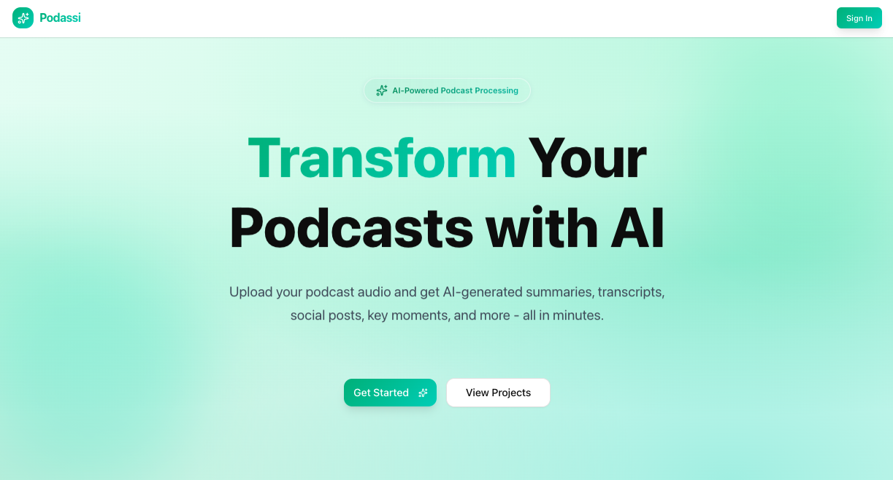
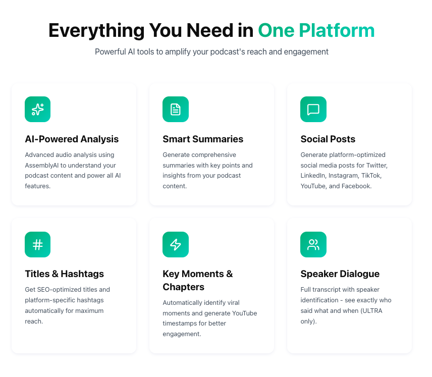
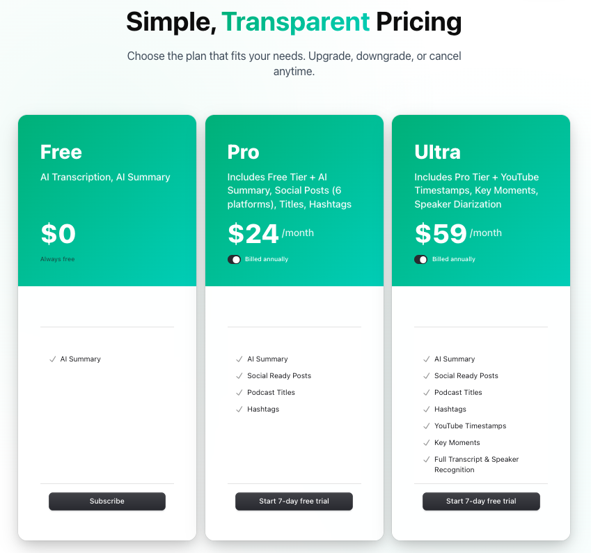
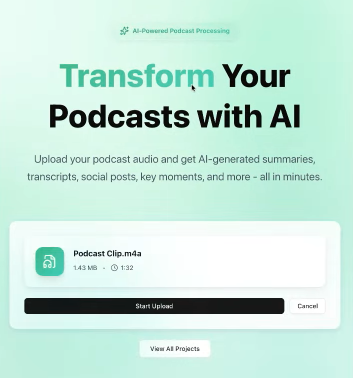
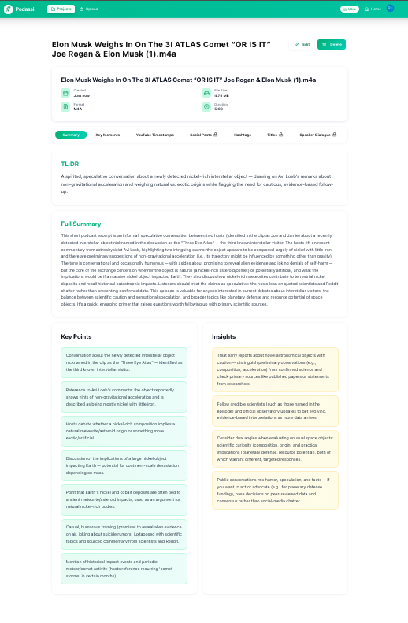
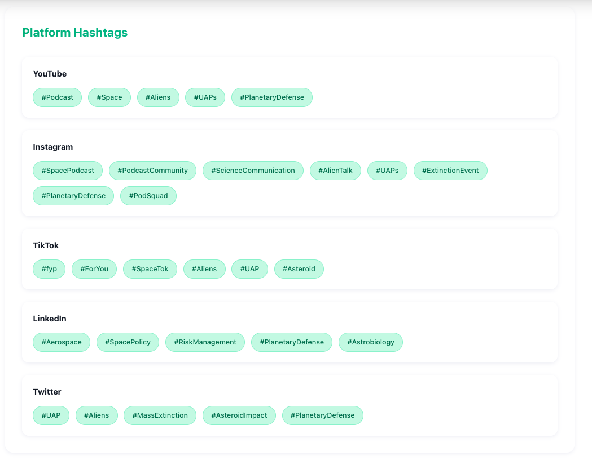
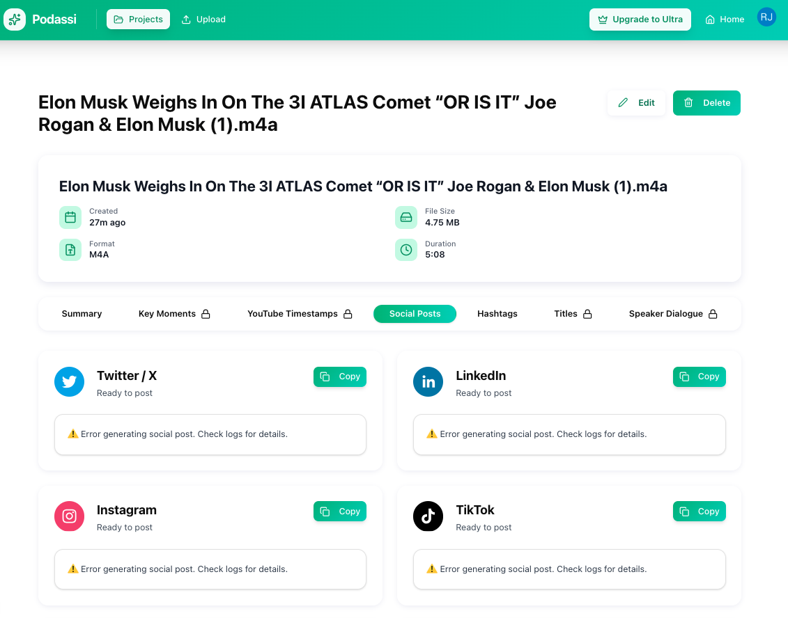

# 🎙️ Podassi AI Podcast SaaS — End-to-End AI Content Engine for Podcasters

[](https://nextjs.org/)
[](https://react.dev/)
[](https://www.typescriptlang.org/)
[](https://clerk.com/)
[](https://convex.dev/)
[](https://www.inngest.com/)
[](https://openai.com/)
[](https://www.assemblyai.com/)
[](https://tailwindcss.com/)
[](https://vercel.com/)

---

## 🎧 AI Podcast SaaS — Your AI Newsroom for Podcast Content

**AI Podcast SaaS** is a production-grade **AI-powered podcast post-production platform** that transforms a single audio upload into a **complete, multi-platform content distribution package**.

This is not just transcription.  
This is **end-to-end AI orchestration** — from upload → analysis → publishing assets.

---

## 🎯 Who This Is For

**Podcast creators drowning in post-production work.**

You already spent hours:
- Recording
- Editing
- Producing

Now you still need to:
- Write social posts for 6 platforms
- Create titles and descriptions
- Generate YouTube timestamps
- Identify viral clip moments
- Write captions and hashtags

**This app does all of that in ~90 seconds.**

---

## ⚡ Key Differentiator

### End-to-End AI Workflow — Not Just Transcription

Most tools stop at transcripts or summaries.

This platform delivers:
- Platform-specific social content
- SEO-optimized titles
- YouTube chapters
- Viral clip timestamps
- Speaker-aware transcripts
- Hashtags optimized per network

All generated automatically from **one upload**.

---

## 🚀 Technical Highlight

### Parallel AI Processing with Inngest (5× Faster)

- ❌ Sequential: 6 jobs × ~50s = ~5 minutes  
- ✅ Parallel: All jobs run simultaneously = ~60 seconds  

**Result:** ~90–120 seconds total processing time.

---

## 🖼️ Screenshots

| | |
|---|---|
| **Landing Page**<br/> | **Features Overview**<br/> |
| **Pricing Plans**<br/> | **Upload Experience**<br/> |
| **AI Podcast Summary**<br/> | **Platform Hashtags**<br/> |
| **Social Media Posts**<br/> |  |

---

## ✨ Features

### 📝 AI Summary
- Bullet-point overview
- Key insights
- TL;DR for quick sharing

### 📱 Social Media Posts (6 Platforms)
- **Twitter/X** — punchy, 280-char hooks  
- **LinkedIn** — professional thought leadership  
- **Instagram** — visual hooks + engagement prompts  
- **TikTok** — casual, trend-aware tone  
- **YouTube** — descriptions with CTAs + timestamps  
- **Facebook** — community-driven conversation starters  

### 🎯 Title Suggestions
- YouTube Short (under 60 chars)
- YouTube Long (SEO-optimized)
- Podcast episode titles
- SEO keyword variations

### #️⃣ Hashtags
- Platform-specific
- Optimized for reach and discoverability

### ⏱️ YouTube Timestamps (Ultra)
- Auto-generated chapters
- Improves navigation and retention

### 🎤 Key Moments (Ultra)
- AI-identified viral clip opportunities
- Includes timestamps and context

### 👥 Speaker Diarization (Ultra)
- “Who said what”
- Speaker labels with confidence scores

---

## 🔧 Technical Features

- ⚡ Parallel AI processing with Inngest
- 🔄 Real-time UI updates via Convex (no polling)
- 🛡️ Durable workflows with automatic retries
- 📊 Plan-based feature gating (Free / Pro / Ultra)
- 🎨 Dark mode support
- 📦 End-to-end type safety (TypeScript + Zod)
- 🔐 Secure by default with Clerk auth & RLS

---

## 💰 Pricing Tiers

| Feature | FREE | PRO ($24/mo) | ULTRA ($59/mo) |
|------|------|--------------|----------------|
| Projects | 3 lifetime | 30 / month | Unlimited |
| File Size | 10 MB | 200 MB | 3 GB |
| Max Duration | 10 min | 2 hours | Unlimited |
| AI Summary | ✓ | ✓ | ✓ |
| Social Posts | ✗ | ✓ | ✓ |
| Titles & Hashtags | ✗ | ✓ | ✓ |
| YouTube Timestamps | ✗ | ✗ | ✓ |
| Key Moments | ✗ | ✗ | ✓ |
| Full Transcript | ✗ | ✗ | ✓ |
| Speaker Diarization | ✗ | ✗ | ✓ |

---

## 🛠️ Tech Stack

| Layer | Technology |
|-----|-----------|
| Frontend | Next.js 16, React 19 |
| Language | TypeScript |
| Auth & Billing | Clerk |
| Realtime DB | Convex |
| Workflows | Inngest |
| Transcription | AssemblyAI |
| AI | OpenAI GPT-4 |
| Storage | Vercel Blob |
| UI | shadcn/ui + Tailwind CSS v4 |
| Deployment | Vercel |

---

## 📦 Installation

```bash
git clone https://github.com/johnsonr84/ai-podcast-saas
cd ai-podcast-saas
pnpm install
pnpm convex dev
pnpm dev
```

App runs at: http://localhost:3000

---

## 👨‍💻 Author

**Robert Johnson**  
Full-Stack Software Engineer  
https://robertjohnsonportfolio.com
